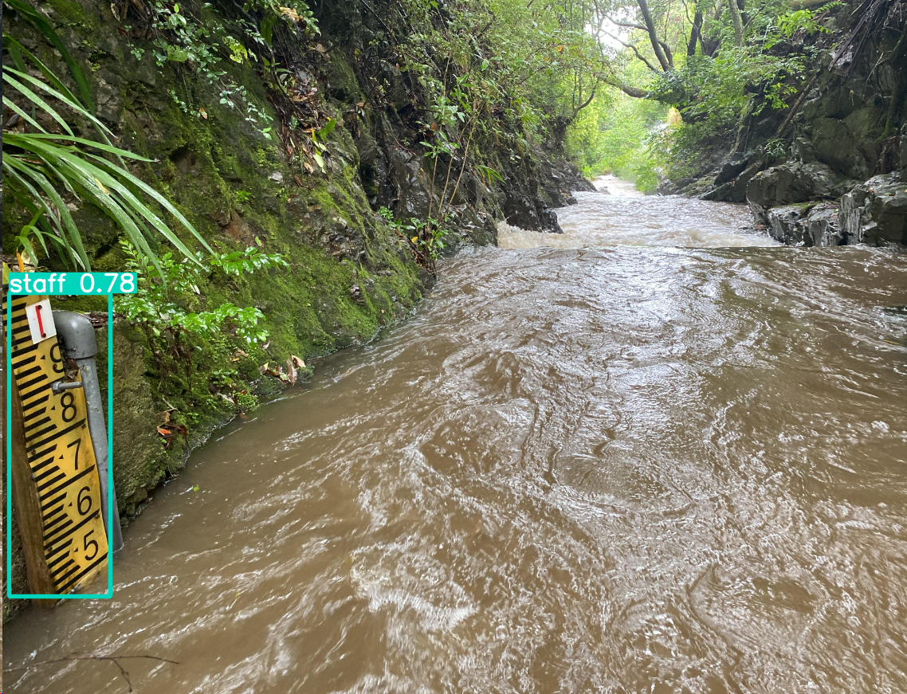

## This code file is based on Yolo V5, to run this code just follow this bellow steps:

#### The first version demo:



##### train with dataset: DATAS2-4

```
!python train.py --img 640 --batch 16 --epochs 10 --data DATAS2-4/data.yaml --weights yolov5s.pt
```

##### test with dataset: DATAS2-4

```
!python detect.py --source DATAS2-4/valid/images --weights runs/train/exp4/weights/best.pt
```

##### Test with dataset: BOPRC_test

```
!python detect.py --source BOPRC_test --weights runs/train/exp/weights/best.pt
```

### How to make our own dataset:

#### The website: https://roboflow.com/ , after upload images, use the label tool to label the images, then export the dataset to YOLOv5 format.

#### After we have the exported yolov5 format dataset, we can use it to train our model same like the code above.

#### After we trained the model it will locate at 'runs/train/exp/weights/best.pt'

### Then we can use it for real time detection:

```
!python detect.py --source 0 --weights runs/train/exp/weights/best.pt
```

<<<<<<< Updated upstream

#### For andorid app, we can use the tflite model, to convert the model to tflite model, just follow this bellow steps:

```
!python export.py --weights runs/train/exp/weights/best.pt --img 640 --batch 1
```

=======

#### For export to tflite model(for embedded into mobile device):

```
!python export.py --include tflite --imgsz 320 --weights runs/train/exp/weights/best.pt
```

#### The version 2 is trained with dataset: DATAS2-4, it have more images which labeled all the numbers from 0 to 9 on the scale


